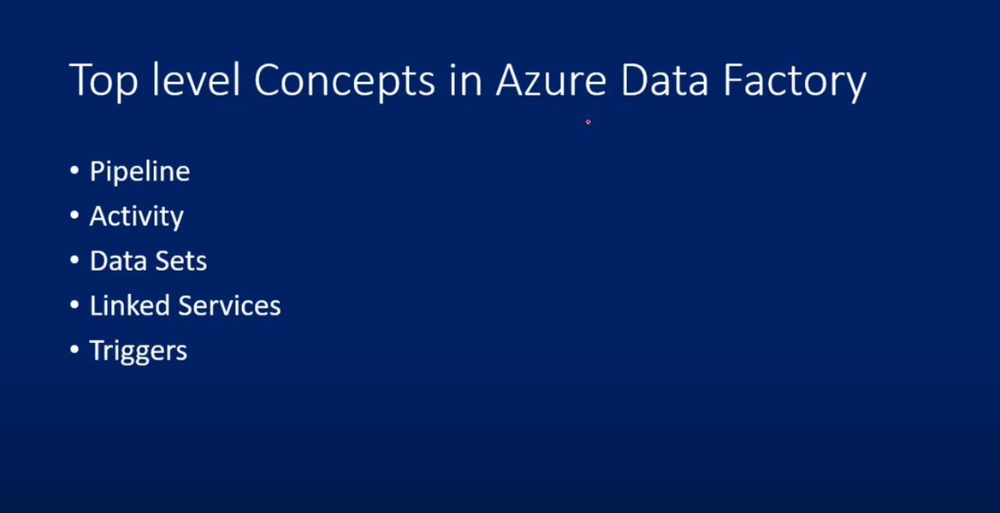

# 🔷 What is Azure Data Factory (ADF)?
Azure Data Factory (ADF) is a cloud-based data integration service that allows you to **create**, **schedule**, and **orchestrate** data pipelines to **move** and **transform** *data* from various sources to destinations.

**Real-life Analogy:**
Imagine you work in a logistics company. You have to:

- Pick items from different suppliers (data sources),

- Pack or modify them (data transformation),

- Deliver them to customers (destination systems).

***ADF is the logistics manager of your data world.***

1. ***ADF-*** its an Azuer service

2. ***ETL cloud service:-***
Etract (Read data) , Transform(perform operation ) , Load (store at destination)

3. ***Use SSIS (SQL SERVER INTEGRATION SERVICES PACKAGES)***
 
### ✅ Why is Azure Data Factory used?
**ADF is used for:**
- Data movement (copy data from source to destination),

- Data transformation (clean, reshape, enrich),

- ETL / ELT processes,

- Orchestration of complex workflows,

- Integrating cloud & on-premises data (e.g., SQL Server, Oracle, Azure Blob, REST APIs).

### ❓ Why do we need to learn ADF?
**As a Data Engineer:**
- You are expected to build and manage data pipelines.

- Most companies are shifting to cloud-based data platforms.

- ADF is a top skill in the Azure ecosystem and widely used in enterprise data engineering.

### 💡 Advantages of Azure Data Factory
|**Feature** |	**Advantage** |
|------------|----------------|
| No code / low code |	You can build complex workflows visually with minimal coding. |
| Scalable	| Handles huge volumes of data, grows with your needs. |
| Pay-as-you-go |	Cost-effective, pay only for what you use. |
| Flexible Integration	| Connects to 90+ data sources (SQL, SAP, REST, CSV, BigQuery, etc.).|
| Monitoring & Logging |	Built-in monitoring, alerts, retry mechanisms.|
|Global |	Available in all Azure regions – fast and reliable.|

### 🛠️ What kind of service is ADF?
|**Category** |	**Detail** |
|---------|--------|
| ***Type*** |	PaaS (Platform as a Service) |
|***Service Model***|	Data Integration |
|***Hosted On*** |	Microsoft Azure Cloud |
|***Related Services***|	Azure Synapse, Databricks, Azure SQL, Logic Apps |

### 🧠 Core Concepts to Learn in ADF 
| **Concept** |	**What it Does** |
|-------------|------------------|
| Pipeline |	A group of activities (like steps in a recipe).|
| Activity |	Individual task (copy, transformation, execution).|
| Dataset |	Metadata pointing to data (like a file or table).
| Linked Service |	Connection string to a data source or sink.|
|Trigger |	Tells when to run the pipeline (on schedule, event, etc
).|
|Integration Runtime|	The engine that runs the activities (self-hosted or Azure-hosted).|

---

### Extra notes:

**SSIS --> ETL PIPELINE --> DESTINATION DATA --> POWER BI**

***Example***- you onwer of a game  
will generate so many logs
logs stores in ADLS (raw data) : big data (unstructured data)

Customer's information  and market camping - on primes storage 

## Top level Concepts in Azure Data Factory

