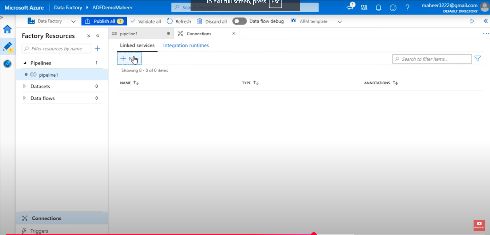
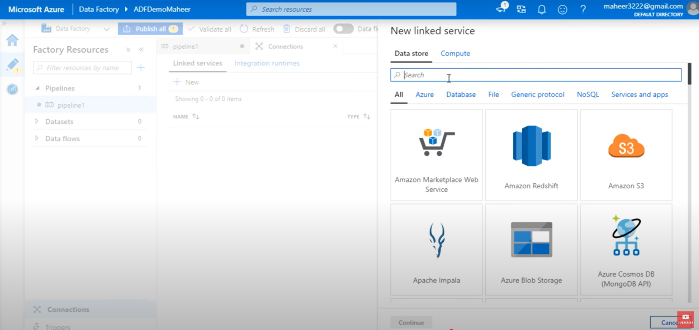

# Pipeline in Azure Data Factory 


## 🧠 What is a Pipeline in Azure Data Factory (ADF)?

**💬 Simple Definition:**

A ***Pipeline*** in Azure Data Factory is like a ***recipe.*** It’s a step-by-step list of instructions that tells Azure:

- "Hey, here’s what data I need, where to get it from, what to do with it, and where to send it."

- It helps automate data movement and data transformation tasks

**🎯 Real-life Analogy (Very Simple):** Imagine you own a restaurant 🍝:
You have to:

- Get vegetables from a farm 🚜 (getting data)

- Clean and cut them 🧼🔪 (transforming data)

- Cook and serve them to customers 🍲 (loading data somewhere)

## 🧱 Key Components of a Pipeline:
Let’s break it down step-by-step like LEGO blocks:


| **Component** |	**Simple Meaning ** |	**Real-Life Example** |
|---------------|-----------------------|----------------|
|***Pipeline*** |	The container or the recipe |	The recipe book 📖 |
| ***Activity***|	A single step in the pipeline |	Washing, cutting, cooking 🥕🍳 |
| ***Dataset***	| Info about data you want to use |	A bowl where you’ll put your chopped veggies 🍚 |
| ***Linked Service*** |	The connection info for data  sources |	 Directions to the farm or kitchen (data source/destination) 🗺️ |
| ***Trigger*** |	What starts the pipeline |	Timer that says “Start cooking at 5 PM” ⏰ |

## 🛠️ Why do we use Pipelines in ADF?
1. Automate data tasks (no need to do them manually)

2. Move data from one place to another (e.g., from a SQL database to a storage account)

3. Transform data using services like Data Flow or Databricks

4. Schedule jobs to run daily, hourly, or based on events

## 🔄 Types of Activities in a Pipeline:
Think of these as types of work the pipeline can do:


| **Type**	| **What it Does** |	**Example** |
|-----------|------------------|----------------|
| ***Copy Activity*** | 	Moves data |	Copy data from Excel to SQL |
|***Data Flow*** |	Transforms data |	Clean messy data like removing NULLs |
| ***Stored Procedure Activity*** |	Runs SQL code |	Run a stored procedure in a DB |
| ***Web Activity*** |	Calls an API |	Get live weather data 🌦️ |
|***Execute Pipeline*** |	Runs another pipeline |	Like calling another recipe from your cookbook |


## 📌 Triggers (When Pipelines Start):

| **Trigger Type** | **Meaning** |	**Example** |
|------------------|-------------|--------------|
|***Schedule*** |	Based on time |	Run every day at 2 AM ⏰ |
|***Event-based***|	Reacts to changes |	Start when a new file is uploaded to Blob Storage |
|***Manual*** |	You press “Run”	| When testing manually during dev
--- 

# Activity in Pipeline 
- Activity  represent a processing step in a pipeline.

***Example:-***
    you might use a copy data from one data store to another data store.

### Visual represenatation
```
Pipeline
 └── Activity 1 (Copy data from Blob to SQL)
 └── Activity 2 (Transform data)
 └── Activity 3 (Send notification)
```

---

# Linked Services 
- This tells ADF where to go to get or send the data — like your Google Maps route.

**Linked service Azure data factory**


**New linked services to create**


- Linked services are much like  connection strings , which define the connection information that's needed for Data Factory to connect to external source.

### 🎯 Real-Life Example:
If you want to access a bank, you need:

- The bank's address

- Your login credentials,
***That's a Linked Service.***

**In ADF:**

- Linked Service to an Azure SQL database

- Linked Service to an Amazon S3 bucket

- Linked Service to a file on FTP

---
# DataSet
- This tells ADF what data to use. Not the data itself, just the structure.
- Dataset represents data structures within the data stores , which simply point  to or reference the data you wnat to use in your activities.

### 🎯 Real-Life Example:
A recipe (Dataset) describes:

- Type: Pasta

- Ingredients needed

- Quantity, format (grams, cups)

**In ADF:**

A dataset can point to:

1. A CSV file on Blob Storage

2. A table in SQL database

3. A JSON file in Data Lake

---
# Triggers 
- This defines when a pipeline should run.
- Triggers Determines when a pipeline execution needs to be kicked off. 

## 🔔 Types of Triggers in Azure Data Factory (ADF)

### 1. ⏰ Schedule Trigger
Runs the pipeline on a specific time or recurring schedu**le (daily, hourly, weekly, etc.)

**✅ When to Use:**
- Every day at 2 AM

- Every Monday morning

- Every 15 minutes


### 2. 🗂️ Tumbling Window Trigger
Runs at fixed intervals like Schedule, BUT it’s more advanced. It waits for the previous run to finish before starting the next.
It can depend on past runs (data dependencies).

**✅ When to Use:**
- When each chunk of data depends on the previous

- When you process hourly logs one-by-one

**🧠 Real-Life Example:**
A washing machine that only starts the next load after the current one is finished.

### 3. 📥 Event-Based Trigger
Runs the pipeline when something happens, like a **file is dropped** in a folder (Blob storage).

**✅ When to Use:**
- When a new CSV file is uploaded to storage

- When data arrives in a folder and needs to be processed instantly

**🧠 Real-Life Example:**
A doorbell rings when someone enters your house — event triggers action.


### 4. 👆 Manual (On-demand) Trigger
You manually click a button to run the pipeline.

**✅ When to Use:**
- For testing

- When you don’t want automation

**🧠 Real-Life Example:**
Clicking the Start button on a microwave to heat food.
