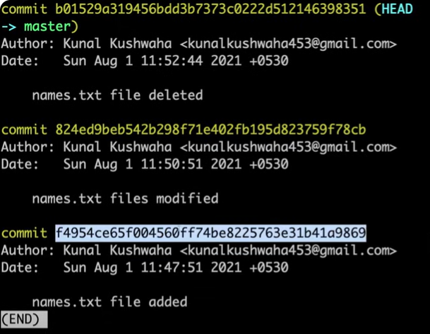

# Git & Github

## ❓ Why we need this ?
- To maintaining the history of the project
- which person made which change  or when 
- Sharing you code around world

## ❓Where is the entire history is stored ?
- No we don't create any other file to maintain the history.
- The all history like create update merge is stored in the folder that git provide us.
- That is known as *git repository* and the name of the folder is **.git** (hidden file).

## 👉 How do we get this folder ?
- Git init  (intializing git in empty folder).
- now we will able to maintain the history.

## 👉 Suppose you have create another file in the project. 
- So you have to fire the command 
`git status`
- This will show which file is added and untracked. 

## 👉 So we have to send the untracked files to stage
- use the command 
`git add .` 
    - this will add all the untrack file in the staging area.
- Otherwise you can specify only perticular file also by using 
`git add untrack.py`.

## 👉 Catch the file in the git history
- By the command 
`git commit`
- Or you can provide the message also 
`git commit -m "my commit"`
- These command catch all the files from staging area and there changes in the git history.

## 👉 Now if you modified something in your file 
- `git add .`
- `git status`
- `git commit`

## 👉 If you want to remove the file from staging area without commiting 
-  `git restore --staged file.md`

## 👉 Where to get the entire history 
- use the command 
`git log`

## 👉 How to delete a file 
- `git add .`
- `git commit -m "file deleted"`
- `git log`

## 👉 If you deleted by mistake or made any commit by mistake or want to remove the commit 
- So you can't delete only one commit which is on middle one 
- Because all the commit created on previous one 
- **So copy the commit code of the previous or last one  commit id that is remaining**

- Again the commit you have copied all the above will delete.
- Use the command
`git reset (paste commit_id)`
- The all the commits files that are modified or changed are in untrack area again.

## 👉 You want to make a big commit like want to track 3 to 4 files together you can track in backstage(just for example)
- Use the command 
`git add .`
`git stash` (on the backstage no commit & saved)
- **Now you want to commit them**
`git stash pop` (comed to unstage area)
`git stash clear`(they are gone now)
---
# 🪝Github

